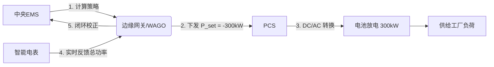

在微电网（Microgrid）系统中，**充放电控制**是实现能源自治、经济运行与高可靠供电的核心环节。其控制不仅依赖软件策略，更需要**底层电力电子设备与通信架构的协同执行**。以下从**控制目标、执行设备、软件角色、典型控制链路**四个维度，系统解释微电网充放电控制的实现机制（截至2026年行业实践）。

---

## 一、微电网充放电控制的核心目标

1. **维持功率平衡**：光伏/负荷波动时，电池快速补偿；
2. **保障关键负载不断电**（离网模式下）；
3. **优化经济性**：低谷充电、高峰放电，降低电费或参与需求响应；
4. **延长电池寿命**：避免过充/过放、高温充放；
5. **支撑电网稳定性**（并网时提供调频、无功支撑）。

---

## 二、充放电控制的**核心执行设备**

软件策略最终必须通过以下**物理设备**执行动作：

| 设备 | 功能 | 控制接口 |
|------|------|--------|
| **1. PCS（储能变流器）** | ⭐ **最核心执行单元**• 双向 AC/DC 转换• 控制充放电功率（kW）、电流、电压• 支持并网/离网切换（<20ms） | • Modbus TCP/RTU• CAN（与BMS通信）• IEC 61850（高端项目）• 模拟量（4–20mA / 0–10V） |
| **2. BMS（电池管理系统）** | • 监测单体电压、温度、SOC/SOH• 执行安全保护（如过压切断）• 向PCS发送允许充放电指令 | • CAN 总线（主流）• RS485 |
| **3. EMS（能量管理系统）** | • 高层策略决策（何时充？充多少？）• 协调光伏、负荷、电网、储能 | • 以太网 + TCP/IP• MQTT / REST API |
| **4. 智能电表 / 关口表** | • 实时测量电网交互功率、负荷曲线• 为防逆流、需量管理提供数据 | • Modbus, DL/T645, IEC 62056 |
| **5. 继电器 / 断路器（可选）** | • 紧急情况下物理切断电池回路 | • 硬接线干节点 |

> ✅ **关键点**：  
> **PCS 是充放电指令的“最终执行者”** —— 它接收来自 EMS 的功率设定值（如 “+500kW 放电”），并通过内部 DSP 控制 IGBT 开关，精确输出所需电流/电压。

---

## 三、软件在充放电控制中的作用

软件并非直接“通断电流”，而是**分层决策 + 指令下发 + 状态闭环**：

### ▶ 分层控制架构（典型三层模型）

| 层级 | 名称 | 职责 | 响应时间 | 软件/硬件 |
|------|------|------|--------|---------|
| **L1** | **本地控制器**（PCS/BMS 内嵌） | 电压/电流环控制、保护逻辑 | <10 ms | 固件（C/C++） |
| **L2** | **微电网控制器**（μGC）或 **边缘EMS** | 功率分配、模式切换（并/离网） | 10–100 ms | 嵌入式Linux（如WAGO PFC200） |
| **L3** | **云平台 / 中央EMS** | 经济调度、预测优化、策略下发 | 1–15 分钟 | 云端软件（如鲸能OS、iSolarBP） |

### ▶ 软件具体功能：
1. **策略计算**  
   - 基于电价、天气预报、负荷预测，生成未来24小时充放电计划；
   - 实时检测异常（如 SOC < 20% 且负荷突增 → 禁止放电）。

2. **指令下发**  
   - 向 PCS 发送 **有功功率设定值（P_set）** 和 **无功功率设定值（Q_set）**；
   - 示例 Modbus 寄存器写入：`Write Register 40001 = 50000`（表示 +50kW 放电）。

3. **状态监控与反馈**  
   - 读取 PCS 实际输出功率、BMS SOC、温度；
   - 若实际值偏离设定值 >5%，触发告警或重新调度。

4. **模式管理**  
   - 电网故障时，自动下发“离网切换”指令给 PCS；
   - 恢复供电后，执行“同步并网”流程。

---

## 四、典型控制执行链路（以“削峰填谷”为例）

> **场景**：某泰国工厂，白天光伏充足，傍晚电价高峰需放电。

- **步骤1**：EMS 根据 TOU 电价表，决定 18:00–22:00 放电；
- **步骤2**：通过 MQTT 或 Modbus TCP 向 PCS 发送功率指令；
- **步骤3**：PCS 内部 DSP 控制 IGBT 开关，将电池 DC 转为 AC 并注入母线；
- **步骤4**：关口表每秒上报总进线功率；
- **步骤5**：若实际用电超预期，EMS 动态增加放电功率。

> ⚡ **执行延迟**：从软件下发指令到 PCS 输出稳定功率，通常 **<500ms**（满足 ISO 15479 微电网响应要求）。

---

## 五、不同应用场景的控制设备差异

| 场景 | 主要执行设备 | 软件复杂度 |
|------|------------|----------|
| **户用离网微网** | 混合逆变器（集成PCS+BMS） | 低（预设策略，App远程启停） |
| **工商业光储** | 独立 PCS + 中央 EMS | 中（需防逆流、需量管理） |
| **海岛/矿区离网微网** | 多 PCS + 柴发 + μGC | 高（黑启动、多源协调、构网控制） |

> 📌 在东南亚，**工商业微网**普遍采用 **阳光电源 SP 系列 PCS + 自研/第三方 EMS**，通过 **Modbus TCP + CAN** 实现充放电控制。

---

## 六、对软件供应商的关键启示

1. **必须深度理解 PCS 控制接口**：  
   - 不同品牌寄存器地址不同（如华为 vs 阳光）；
   - 需支持 **功率模式（P/Q control）**、**电压频率模式（V/f control）** 切换。

2. **边缘计算不可或缺**：  
   - 云平台无法满足 <1s 控制需求，需部署 **边缘网关**（如树莓派 + Node-RED，或 WAGO PFC200）做实时指令转发。

3. **安全冗余设计**：  
   - 软件指令需带 **超时失效机制**（如 5 秒无新指令，PCS 自动转为本地模式）；
   - 紧急情况下，BMS 可**硬线切断**充放电，优先级高于软件。

---

### ✅ 总结一句话：
> **微电网充放电控制 = 软件制定“作战计划” + PCS 执行“开火命令” + BMS 担任“安全官”**。  
> 软件是大脑，但没有 PCS 这个“肌肉”，再聪明的策略也无法落地。作为数字化服务商，您需打通 **“策略→通信→执行→反馈”** 的完整控制闭环。