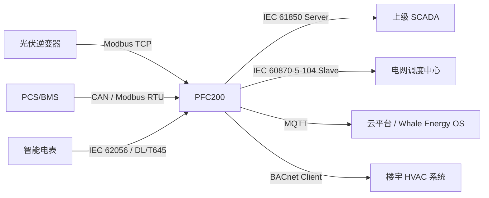

您提供的链接（[WAGO PFC200 Controller 750-8212](https://www.wago.com/de-en/plcs-controllers/controller-pfc200/p/750-8212#accessories)）确实介绍了 WAGO 公司的一款工业级可编程逻辑控制器（PLC），型号 **750-8212**，属于 **PFC200 系列**。它是面向能源、楼宇、基础设施等领域的**边缘控制与通信网关设备**。

---

## 一、PFC200 是什么？

- **全称**：Programmable Field Controller（可编程现场控制器）
- **本质**：一款基于 Linux 的 **工业 PLC + 边缘计算网关**
- **硬件特点**：
  - 双以太网口、RS-232/485 串口
  - 支持 SD 卡扩展、IP20 防护
  - 可运行 C/C++、Python、IEC 61131-3（PLC 编程）
- **典型用途**：
  - 光伏/储能电站的**本地数据采集与控制**
  - 楼宇自动化系统的**协议转换网关**
  - 微电网的**边缘协调控制器（μGC）**

> ✅ 在东南亚光储项目中，PFC200 常被用作 **“多协议聚合网关”** —— 把逆变器（Modbus）、电表（DL/T645）、PCS（CAN）、BMS（CAN）等不同协议的数据统一转为 MQTT 或 IEC 61850 上送云平台。

---

## 二、关键通信协议解释

### 1. **IEC 61850**
- **领域**：电力系统自动化（变电站、新能源电站）
- **特点**：
  - 面向对象建模（如 LD、LN、DO、DA）
  - 支持 GOOSE（快速跳闸）、MMS（监控）、SV（采样值）
  - 是智能变电站和大型光储项目的**国际标准**
- **在 PFC200 中的角色**：
  - 可作为 **IEC 61850 Server（Slave）**：将本地采集的光伏/储能数据建模为 IED（智能电子设备），供上级 SCADA 调用；
  - 也可作为 **IEC 61850 Client（Master）**：读取其他 IED（如保护装置）的数据。
- **应用场景**：越南/泰国 50MW+ 光储项目并入电网时，常要求符合 IEC 61850-7-420（分布式能源模型）。

---

### 2. **IEC 60870-5-104 **
- **正确名称**：IEC 60870-5-104
- **领域**：电网调度自动化（尤其在欧洲、亚洲）
- **特点**：
  - 基于 TCP/IP 的远动协议
  - 用于主站（调度中心）与子站（变电站/电厂）通信
  - 支持遥测（YC）、遥信（YX）、遥控（YK）、遥调（YT）
- **在 PFC200 中的角色**：
  - **Slave（从站）**：将本地数据打包为 ASDU，响应调度主站召唤；
  - **Master（主站）**：较少见，可用于聚合多个 RTU。
- **应用场景**：印尼 PLN、泰国 EGAT 等电网公司要求接入其调度系统时，必须支持 104 协议。

---

### 3. **DNP3（Distributed Network Protocol）**
- **领域**：北美及部分亚太地区的电力、水务 SCADA
- **特点**：
  - 支持事件驱动、时间戳、数据完整性校验
  - 分为 Level 1（串口）和 Level 2（TCP/IP）
- **在 PFC200 中的角色**：
  - **Outstation（= Slave）**：作为现场设备上报数据；
  - **Master**：可轮询多个 DNP3 设备（如老旧 RTU）。
- **应用场景**：菲律宾部分美资背景的微网项目要求 DNP3 接入。

---

### 4. **BACnet**
- **领域**：楼宇自动化（HVAC、照明、电梯）
- **特点**：
  - ASHRAE 标准，广泛用于商业建筑
  - 支持 BACnet/IP、BACnet MS/TP
- **在 PFC200 中的角色**：
  - **BACnet Server（Slave）**：将储能系统状态发布为 BACnet 对象（如 Analog Value）；
  - **BACnet Client（Master）**：读取楼宇负荷数据，用于需量管理。
- **应用场景**：马来西亚/新加坡的工商业光储项目需与楼宇管理系统（BMS）联动。

---

## 三、“Master / Slave” 是什么意思？

这是**主从通信模型**的基本概念：

| 角色 | 英文 | 行为 | 类比 |
|------|------|------|------|
| **主站** | Master / Client | **主动发起请求**（如“读取电压”） | “老板问员工进度” |
| **从站** | Slave / Server / Outstation | **被动响应请求**（如返回电压值） | “员工汇报工作” |

### 在 PFC200 中的灵活配置：
- 同一台 PFC200 可同时是：
  - **Modbus TCP Slave**（供云平台读取数据）
  - **IEC 60870-5-104 Slave**（供电网调度读取）
  - **BACnet Client**（主动读取空调负荷）
  - **DNP3 Master**（轮询柴油发电机状态）

> ✅ 这种“多角色并发”能力，使其成为**理想的协议转换枢纽**。

---

## 四、在光储微电网中的典型应用架构

- **PFC200 的作用**：
  1. 采集底层设备数据（多协议）
  2. 执行本地控制逻辑（如防逆流：若关口功率 > 0，则限发光伏）
  3. 将统一数据模型通过不同协议上送至不同系统

---

## 五、对软件供应商的价值

1. **降低集成复杂度**：  
   您无需直接对接 10 种协议，只需与 PFC200 的 **MQTT 或 REST API** 通信。

2. **满足合规性要求**：  
   通过 PFC200 内置的 IEC 61850 / 104 协议栈，快速满足电网接入规范。

3. **边缘智能前置**：  
   可在 PFC200 上部署轻量 AI 模型（如 Python 脚本），实现本地预测性维护。

---

### ✅ 总结

> **WAGO PFC200 750-8212 是一款支持多协议（IEC 61850、104、DNP3、BACnet 等）的工业边缘控制器，可灵活配置为 Master 或 Slave，充当光储系统中的“通信中枢”和“本地大脑”。**  
> 它解决了新能源项目中“设备协议碎片化”与“上层系统标准化”之间的矛盾，是构建开放、兼容、合规的微电网监控系统的关键硬件底座。

如果您正在开发第三方监控平台，建议将 PFC200 作为**标准边缘接入设备**，利用其协议转换能力，大幅简化现场部署。